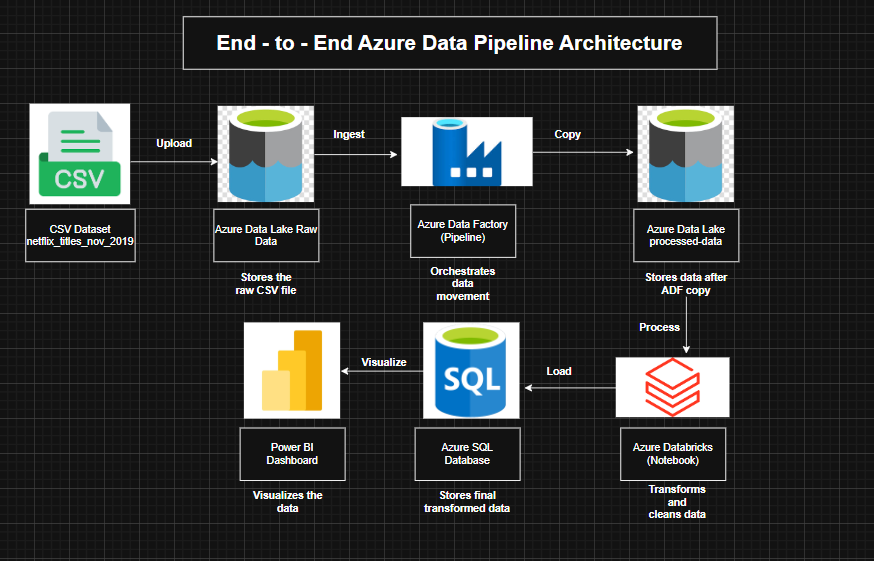
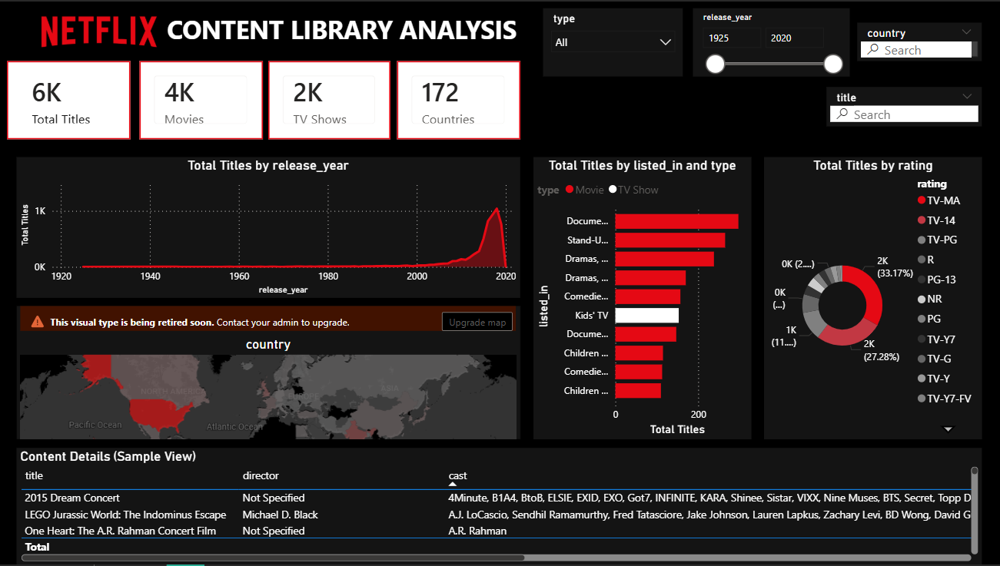

# Azure Data Engineering Pipeline

## Project Overview
This project demonstrates an **end-to-end data engineering pipeline** using Microsoft Azure services. The pipeline covers:

- Data ingestion from **Azure Data Lake Storage**
- Data transformation using **Azure Databricks (PySpark)**
- Storing processed data in **Azure SQL Database**
- Building interactive dashboards using **Power BI**

This project is designed as a **portfolio project** for students in Data Science and Data Engineering.

---

## Architecture Diagram


### Power BI Dashboard


**Pipeline Flow:**

1. **Raw Data** → uploaded to **Azure Data Lake (raw-data container)**
2. **Data Transformation** → performed in **Azure Databricks** using PySpark
3. **Processed Data** → saved back to **Azure Data Lake (processed-data container)**
4. **Azure SQL Database** → load cleaned dataset
5. **Power BI Dashboard** → connect to SQL Database for visualization

---

## Tools & Technologies Used
- **Azure Data Lake Storage** – store raw and processed data
- **Azure Data Factory** – orchestrate data movement
- **Azure Databricks (PySpark)** – data cleaning and transformation
- **Azure SQL Database** – store processed data
- **Power BI** – build interactive dashboards
- **Git & GitHub** – version control and portfolio showcase

---

## Project Folder Structure
```text
Azure_Data_Pipeline_Project/
│
├─ dataset/                  # Raw dataset (CSV)
├─ notebooks/                # Databricks notebooks (.dbc or .ipynb)
├─ architecture/             # Architecture diagrams
├─ screenshots/              # Power BI dashboard screenshots
└─ README.md                 # Project documentation
